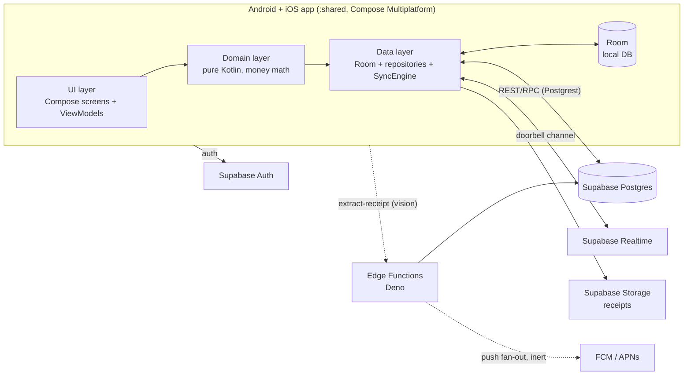

# Evenly — Architecture

Technical specification of what Evenly is built on and how the pieces fit together. This is a
snapshot of the current system, not a build plan — for what's built vs. remaining, see
`REMAINING_WORK.md`; for the original pre-build spec (partially superseded, see notes below), see
`spec/`. Nested `AGENTS.md` files under `code/shared/src/commonMain/kotlin/app/splitevenly/`
are the source of truth for implementation details in each layer; this file stays one level up.

**Status: pre-production.** No real users yet, RLS is intentionally permissive, and local storage
uses a destructive-migration fallback. `data/AGENTS.md` and `supabase/AGENTS.md` carry the full
prod-readiness gate (P0 list) that must close before real user data is at risk.

## 1. System shape



The client is **offline-first**: every screen reads from Room, every write lands in Room first, and
a background `SyncEngine`/`SyncManager` carries mutations to Supabase and pulls remote changes back.
Supabase Realtime is used only as a per-group "something changed, pull now" doorbell — the client
never trusts realtime payload contents (see §4).

## 2. Tech stack

| Layer | Choice | Notes |
|---|---|---|
| Client language/UI | Kotlin Multiplatform + Compose Multiplatform | One shared UI and logic module (`:shared`) for both platforms; no separate native UI. |
| Targets | Android (minSdk 24, compile/target 36), iOS 16+ (`iosArm64`, `iosSimulatorArm64`) | Two thin app hosts (`:androidApp`, `iosApp/` Xcode project) around the shared module. |
| Local DB | Room (KMP), bundled SQLite driver | Single local source of truth; UI never talks to the network directly. |
| Networking | Ktor client + `supabase-kt` | Ktor version hard-pinned to what `supabase-kt`'s BOM was built against. |
| Backend | Supabase: Postgres, Auth, Storage, Realtime, Edge Functions (Deno) | Backend-as-a-service; no custom server process. |
| DI | Koin | `commonMain` modules + a small `androidMain`/`iosMain` platform module. |
| Navigation | Compose Navigation Multiplatform | Type-safe `@Serializable` routes (with one Kotlin/Native caveat, §6). |
| Async images | Coil 3 (Ktor network fetcher) | |
| Logging | Kermit (+ Crashlytics writer, consent-gated) | |
| Analytics / crash | Firebase Analytics + Crashlytics, PostHog (unofficial KMP wrapper) | Ad-ID collection off; consent-gated. |
| Receipt OCR | Claude (vision) via a Supabase Edge Function (`extract-receipt`) | Multi-page (image/PDF), pre-fills an editable draft only — never computes money unverified. |
| Push | FCM (Android) + FCM→APNs bridge (iOS), via edge functions | Deployed but currently inert (no service-account secret configured). |
| FX rates | Frankfurter (ECB-backed, no API key) | Build-time baked snapshot + daily refresh + Room cache. |
| Build | Gradle (wrapper-pinned) + AGP + KSP2, from `code/` | Kotlin 2.3.21 is the version anchor; every other compiler-coupled version derives from it — see `code/gradle/libs.versions.toml` and the compatibility policy in `spec/06-architecture-and-stack.md §6.3`. |

Exact dependency versions live only in `code/gradle/libs.versions.toml` — do not duplicate them
here; they drift too fast for a spec doc to stay honest.

## 3. Module layout

```
Evenly/
├── architecture.md            ← this file
├── design/                    ← visual source of truth for UI
├── spec/                      ← original pre-build spec (00-09); superseded in places, see §7
├── code/                      ← the Gradle project (open this in Android Studio)
│   ├── shared/                ← KMP library: all business logic + all Compose UI
│   │   └── src/commonMain/kotlin/app/splitevenly/
│   │       ├── core/          ← Money, IDs (UUIDv7), AppError/AppResult, Logger, Clock
│   │       ├── domain/        ← pure Kotlin: use cases, repository interfaces, split/balance math
│   │       ├── data/          ← Room, Supabase clients, SyncEngine, repository impls
│   │       ├── ui/            ← Compose screens, navigation, viewmodels, theme
│   │       ├── platform/      ← expect declarations (actuals in androidMain/iosMain)
│   │       └── di/            ← Koin modules
│   ├── androidApp/            ← thin Android host: manifest, Firebase config, MainActivity
│   └── iosApp/                ← thin iOS host: Xcode project, Info.plist, AppDelegate
├── supabase/                  ← schema.sql, migrations, seed data, edge functions
└── tools/                     ← scripts (e.g. receipt-ocr-lab)
```

Platform-specific code (`androidMain`, `iosMain`) lives **inside** `:shared`, under the same
`platform/` package as the `expect` declarations it implements — not in the app hosts. The app
hosts hold only shell concerns: manifest/Info.plist, signing, push registration entry points, and
the OS entry point that renders the shared `App()` composable.

## 4. Architectural layers (clean architecture, package-enforced)

```
ui (Compose screens + viewmodels)
  → domain (use cases + repository interfaces; pure Kotlin, no I/O)
      → data (Room, supabase-kt, SyncEngine, repository implementations)
          → core (Money, AppResult/AppError, IDs, Logger)
```

- **`domain` is pure.** No Room, Supabase, Compose, or platform imports — this is what makes the
  money-math tests runnable on both JVM and Kotlin/Native.
- **`ui` never touches `data` directly.** Screens are DI-free (plain callbacks, so `@Preview`
  works); a `Route` wrapper in `ui/navigation/` does the `koinInject` wiring.
- **`data` owns every side effect** — Room, network, sync, and the translation of exceptions into
  the typed `AppError` hierarchy consumed by the UI.
- Layers live as packages inside one Gradle module (`:shared`), not separate modules; boundaries
  are enforced by convention plus Koin wiring, not build-graph walls.

**Error model:** fallible operations return a sealed `AppResult<T>` (`Ok`/`Err(AppError)`), not
`kotlin.Result` or thrown exceptions across layer boundaries. `AppError` is a sealed hierarchy
(`Network`, `Backend`, `Validation`, `Conflict`, `SessionExpired`, `Unexpected`) so the UI can
exhaustively `when` over failure and react per category (retry, re-login, inline validation, …).

## 5. Data flow and sync model

- **Local-first:** every read streams from Room; every write lands in Room first.
- **Realtime is a doorbell, not CDC.** The only table in the Supabase realtime publication is
  `group_activity` (one bump row per group). A realtime event means "something changed in this
  group, pull now" — the client never trusts payload contents, so publishing any other table is
  forbidden (a past mistake here burned 13.9M realtime messages against a 5M quota).
- **Expenses sync through a zone-aware merge RPC (`merge_expense`), not a blind upsert.** An
  expense splits into independently-resolved concurrency zones: per-field metadata merges by
  newest timestamp (two people editing different fields both survive), the split (amount/shares)
  is guarded by a causal `split_version` (a stale edit is appended to an audit trail instead of
  silently overwriting or being silently dropped), and settlement state is derived, never stored.
  This replaced an earlier "Conflicts tab" model built around bilateral conflict cards.
- **Money is integer subunits, never floating point**, split via a largest-remainder allocator so
  parts always sum back to the entered total.
- **Soft deletes only.** Rows that carry user or financial data are tombstoned (`deleted_at` /
  `deleted_by`), never hard-deleted, so sync tombstones propagate instead of resurrecting on the
  next pull. The exceptions are two device-local, non-synced tables holding no user data.

## 6. Platform abstraction boundary

Cross-platform capabilities (secure storage, file/photo pickers, push registration, connectivity,
background scheduling, image processing, receipt viewing) are declared as `expect` classes in
`commonMain/platform/` with Android and iOS `actual` implementations. This is the layer where
Kotlin/Native diverges most from Android/JVM — both `actual`s must exist and compile, since the
Android build alone will not catch a Native-only break (e.g. an enum `Route` argument crashes
Navigation on Kotlin/Native; a `String` argument does not).

## 7. Relationship to `spec/`

`spec/00-09` is the original pre-implementation specification and is still useful for rationale and
the full decisions log, but parts of it are superseded by what actually shipped — most notably the
sync model (§5 above replaced the spec's server-authoritative LWW + Conflicts-tab design) and
receipt OCR (the spec listed it as out of scope for v1; it now exists). Where this file and `spec/`
disagree on current behavior, this file and the nested `AGENTS.md` files win; `spec/` remains the
historical record of why v1 was scoped the way it was.

## 8. Build, environments, and CI

- `gradlew` lives in `code/`. JDK 17. See the root `AGENTS.md` §5 for the compile/test/run commands
  for both platforms.
- Backend changes (schema, RPCs, edge functions) are applied via the Supabase CLI/MCP and live in
  `supabase/`, versioned alongside the client code that depends on them.
- Manual verification defaults to the iOS simulator (`code/iosApp/run-ios-sim.sh`); reach for the
  Android emulator only for Android-specific changes.
